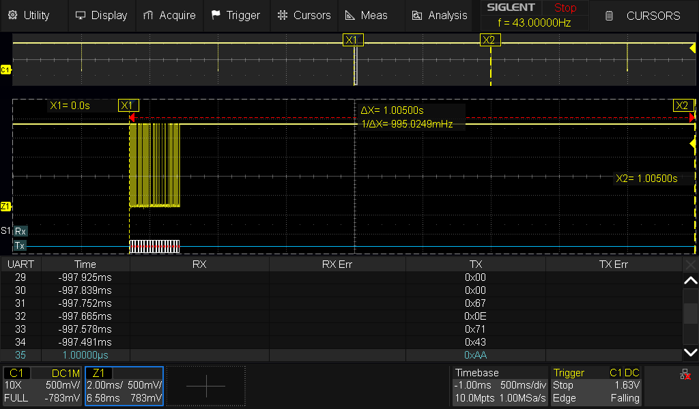
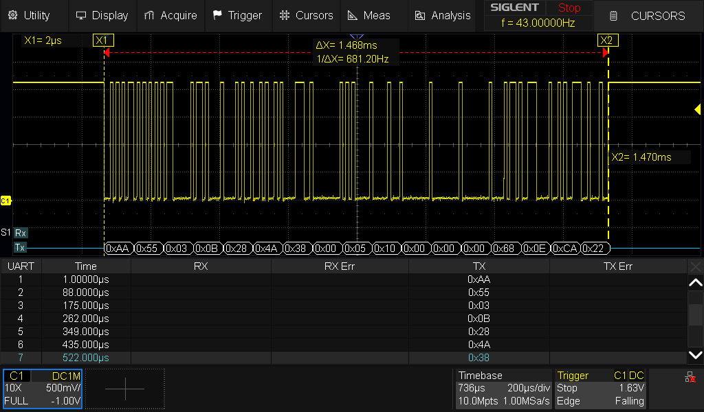
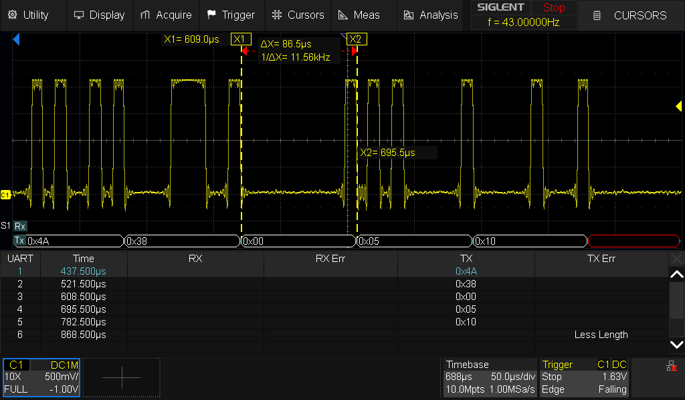

# HIL-001 - scope captures (UART downlink timing)

Companion to the generated [HIL-001.md](HIL-001.md): the wire-level timing evidence for REQ-VV-003, measured on the USART6 downlink (PC6) with a Siglent SDS804X HD, UART decode at 115200 8N1. The generated report is rewritten on every run, so the measured scope evidence lives here, beside it.

| Measurement | Ideal | Measured |
| ----------- | ----- | -------- |
| heartbeat period | 1.0 s nominal, quantized by the ~100 ms super-loop | 1.005 s (cursors); host stats 0.969 / 1.000 / 1.094 s min/mean/max over 59 periods |
| frame duration (17 bytes) | 1.476 ms | 1.468 ms |
| byte-to-byte spacing | 86.8 us (10 bit-times, back to back) | 86.5 us - no measurable inter-byte gap at the 1 MSa/s acquisition |

## Heartbeat period



Cursors span one burst-to-burst interval in the main view: dX = 1.00500 s. The zoom window resolves one burst into its bit structure, and the decode table corroborates in text - the tail of one frame, then `0xAA` (the next frame's sync byte) arriving one second later. The period is not exactly 1.000 s on any single interval because the 1 Hz heartbeat gate is evaluated by a delay-after-work super-loop on a ~100 ms grid; the host-side statistics over 59 periods (mean 1.000 s) carry the strong claim, and fixed-rate execution is REQ-RT-002's to earn in phase 6.

## One whole frame



dX = 1.468 ms across all 17 bytes (ideal 1.476 ms at 86.8 us/byte). The decode reads the complete wire contract in one screen:

```
AA 55        sync
03 0B        msg id 3 (heartbeat), length 11
28 4A 38 00  uptime  = 0x00384A28 = 3,689,000 ms (board up ~61 min)
05           mode    = 5 = SAFE
10 00 00 00  faults  = 0x00000010 = bit 4 = COMMAND_LINK_LOSS
68 0E        seq     = 0x0E68 = 3688
CA 22        crc16
```

The frame is self-consistent: seq equals uptime/1000 (1 Hz, monotonic), and the latched COMMAND_LINK_LOSS with mode SAFE is the documented expected state of a board with no uplink decode yet - the dead man fired at t=5 s after boot, exactly as REQ-CMD-002 requires.

Note: this capture predates the reduced live fault catalog. At capture time `COMMAND_LINK_LOSS` occupied bit 4; in current firmware it is bit 0.

## Inter-byte gap



Cursors from one start-bit falling edge to the next: dX = 86.5 us against the 86.8 us ten-bit ideal - zero measurable gap at this acquisition's resolution. The interrupt-driven ring-buffer TX loads each next byte from the ISR with no dead air between bytes. (The edge ringing is ground-lead artifact from the probe's long ground clip; the "Less Length" decode row is the acquisition window clipping a byte at its edge - neither is a signal defect.)
